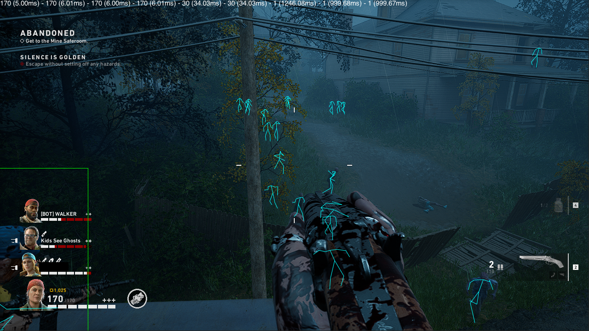

# Images

  

  

# Overview
Small cheat I made for Back 4 Blood during the open beta of the game (Aug 12th to 16th, 2021). This is meant as a reference only. I do not condone cheating in any way, it is merely a side project for fun.

The game runs EasyAntiCheat and there's no bypass included, you'll need your own.

## Design considerations
This was designed to run as a .dll file that does NOT get injected into the game, thus being external. This means that, to access the game memory, there needs to be a context switch from usermode -> kernel and back every time memory is read.

Reading memory slows things down considerably, thus I've made heavy use of multithreading. There's still optimizations to be made, but again, should be good enough.

## Notes
Source code is not complete, there are parts missing you'll need to implement on your own (interfaces and various helper libraries/includes such as json and vector). View it as anti paste.

The development cycle for this was very short, so shortcuts were taken. I've even added and changed a lot of things after the open beta was over, so I couldn't fully test everything. Most of it should work though.